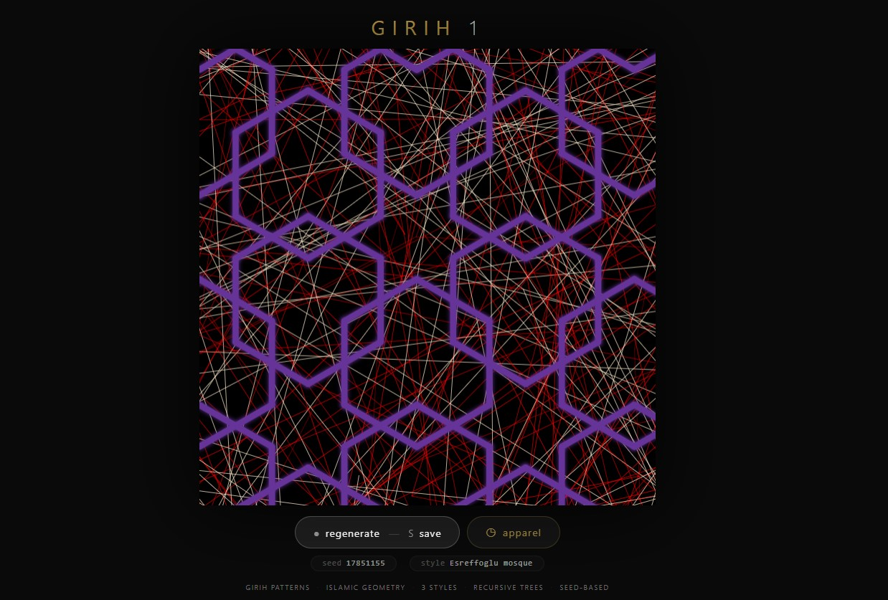
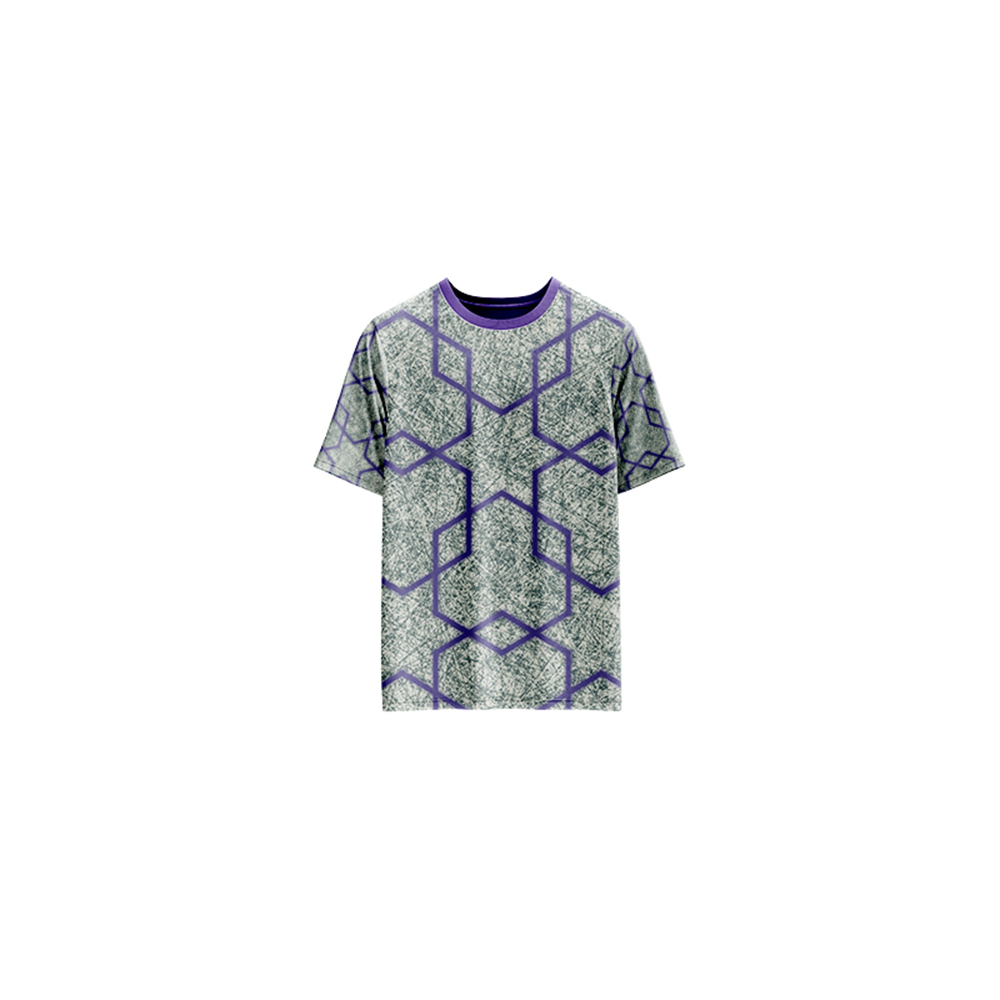

# Girih 1 — Generative Art

[](https://reyrove.github.io/Girih-1-Generative-Art)
[](https://opensource.org/licenses/MIT)

> **Generative Islamic geometric art.** Each refresh creates a unique composition of Girih patterns—intricate star-shaped motifs inspired by Islamic architecture—combined with recursive tree structures.

## 🎨 Live Demo

<div align="center">
  <a href="https://reyrove.github.io/Girih-1-Generative-Art" target="_blank">
    
  </a>
  <br><br>
  <a href="https://reyrove.github.io/Girih-1-Generative-Art" target="_blank">
    
  </a>
  <br>
  <em>Click the image or button to experience the generative art</em>
</div>

## 👕 Apparel Preview

<div align="center">
  
  <br>
  <em>Girih 1 artwork printed on a T-shirt</em>
</div>

## ✨ Features

- **Girih Patterns** — Intricate Islamic geometric star motifs
- **3 Pattern Styles** — Umayyad mosque, Simple hexagram, Esreffoglu mosque
- **Recursive Trees** — Organic branching structures
- **Rich Color Palettes** — 37+ vibrant background and foreground colors
- **Glow Effects** — Soft shadow glow on geometric patterns
- **Seed-Based** — Every composition is unique and reproducible via its seed
- **Save & Share** — Download as PNG with seed in filename
- **Apparel Mode** — Preview artwork on a T-shirt mockup
- **Responsive** — Works on desktop, tablet, and mobile
- **Pure JavaScript** — No external dependencies
- **Keyboard Shortcuts**:
  - `R` — Regenerate
  - `S` — Save image
  - `T` — Toggle apparel view

## 🎨 Artwork Details

| Parameter | Options | Description |
|-----------|---------|-------------|
| **Girih Styles** | 3 types | Umayyad mosque, Simple hexagram, Esreffoglu mosque |
| **Background Colors** | 37+ options | Rich, vibrant colors |
| **Foreground Colors** | 10 options | Deep blue and purple tones |
| **Tree Depth** | 12 | Recursive branching levels |
| **Pattern Size** | Variable | Scales with canvas |

## 🕌 Girih Patterns

Girih (Persian: گره) are decorative Islamic geometric patterns used in architecture and decorative arts. The three styles featured:

| Style | Description |
|-------|-------------|
| **Umayyad Mosque** | Star-based pattern with interlocking motifs |
| **Simple Hexagram** | Six-pointed star pattern with geometric precision |
| **Esreffoglu Mosque** | Complex star pattern with intricate detail |

## 🚀 Quick Start

### Local Development

```bash
# Clone the repository
git clone https://github.com/reyrove/Girih-1-Generative-Art.git

# Navigate to the directory
cd Girih-1-Generative-Art

# Open in browser
open index.html
# or use a live server
```

### Deploy to GitHub Pages

1. Push to GitHub
2. Go to Settings → Pages
3. Select branch `main` and root folder
4. Your site will be live at `https://reyrove.github.io/Girih-1-Generative-Art`

## 🧠 How It Works

The artwork is generated using a deterministic random number generator, seeded by timestamp + random noise. Every refresh:

1. **Setup**:
   - Random background colors (two complementary colors)
   - Random Girih style (3 options)
   - Random foreground color (10 deep blue/purple options)

2. **Tree Generation**:
   - Recursive tree with 12 levels of branching
   - Random branch angles and lengths
   - Gradient color transition between two background colors

3. **Girih Pattern Generation**:
   - Star motifs tiled across the canvas
   - Each style has unique geometric construction
   - Patterns scale with canvas size

4. **Rendering**:
   - Black background
   - Tree drawn first with gradient colors
   - Girih patterns overlaid with glow effect

## 📁 File Structure

```
Girih-1-Generative-Art/
├── index.html          # Main application (all-in-one)
├── Girih-1.jpg         # T-shirt mockup image
├── fav.svg             # Favicon
├── demo-screenshot.jpg # Website demo screenshot
├── README.md           # This file
└── LICENSE             # MIT License
```

## 🛠️ Tech Stack

- **Pure Vanilla HTML/CSS/JS** — No dependencies
- **Canvas API** — 2D rendering
- **CSS Flexbox/Grid** — Responsive layout
- **GitHub Pages** — Hosting

## 🎯 Interactive Controls

| Action | Keyboard | Button |
|--------|----------|--------|
| Regenerate | `R` | Click "regenerate" |
| Save Image | `S` | Click "regenerate" |
| Toggle Apparel | `T` | Click "apparel" |

## 🎨 The Creative Process

### Girih Geometry
Girih patterns are constructed using a set of five standard tile shapes. This artwork recreates the intricate geometry through algorithmic generation, producing patterns that echo the mathematical precision of Islamic art.

### Recursive Trees
The organic tree structures provide a beautiful contrast to the geometric precision of the Girih patterns, creating a harmonious balance between nature and geometry.

### Color Harmony
Two background colors create a gradient effect, while the deep blue/purple foreground patterns stand out with a soft glow, reminiscent of traditional Islamic art illuminated manuscripts.

## 📱 Responsive Design

The application automatically adapts to:
- Desktop screens
- Tablets
- Mobile phones
- Landscape orientation
- Various aspect ratios

## 🤝 Contributing

Contributions are welcome! Feel free to:
- Fork the repository
- Create a feature branch
- Submit a pull request

### Ideas for Contributions:
- Additional Girih patterns
- New color palettes
- Animation features
- Interactive controls
- Performance optimizations

## 📄 License

MIT License — see [LICENSE](LICENSE) file for details.

## 🙏 Acknowledgments

- Inspired by Islamic geometric art and Girih patterns
- Pure JavaScript implementation
- Special thanks to the creative coding community

---

**Built with ❤️ and geometric harmony**